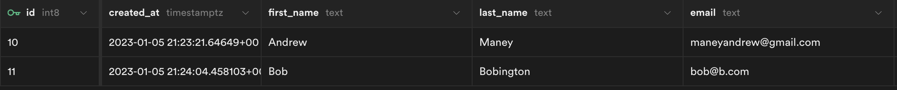

# Summit Project

You can view a live version of the site [here](https://summit-project.vercel.app/).

This is a [Next.js](https://nextjs.org/) project bootstrapped with [`create-next-app`](https://github.com/vercel/next.js/tree/canary/packages/create-next-app). The frontend is served from a single [page](pages/index.tsx). I broke the page down into a few main components, including:

-   [`Header`](components/header.tsx)
-   [`Form`](components/newsletterForm.tsx)
-   [`Success`](components/success.tsx)
-   [`Curation`](components/curation.tsx)

Most of the heavy lifting happens in the `Form` component. The form is composed of a number of custom `Input` components which encapsulate the markup, styling, and error handling. The error handling is done using [native form validation](https://developer.mozilla.org/en-US/docs/Learn/Forms/Form_validation). I like to use native solutions whenever possible in order to keep the number of dependencies to a minimum.

I noticed that you were using Bootstrap on the live site so I brought that in here for continuity. I tried to use the library as much as possible instead of creating my own custom styles. Bootstrap has nice built-in form validation UI which I implemented here.

When designing my solution I tried to keep extensibility in mind to keep it as future-proof as possible. If the scope of the project were to change, for example, and we had to add or remove inputs, the component system would allow for that relatively simply.

## Backend

The form POSTs the data to a [Next API route](https://nextjs.org/docs/api-routes/introduction) (seen at [form.ts](pages/api/form.ts)). This route then inserts the data into my database. I spun up the db using [supabase](https://supabase.com/), which is basically an open-source version of Firebase. This is what the table looks like after a few insertions:



## Weird Things

I like Next, but the framework has some interesting ways of doing things. This forced me into strange solutions which I have mixed feelings on.

1. Background images

The built-in Next `Image` component is great because it can provide optimization; however, this gets weird with background images. Apparently, the recommended solution for bg images (if you want the optimization) is to essentially insert the image as an actual element with an `absolute` position. That's why I built the seemingly over-engineered [`backgroundImage` component](components/backgroundImage.tsx).

**Pros:** provides performance of Image component
**Cons:** much more work than just using `background-image` CSS

2. CSS Modules

When I spun up my Next project using the CLI, the default way styles were handled was through CSS modules. I decided to stick with this and try it out. These were nice because they provide encapsulation for your styles (they are tied directly to your components). But they are kind of annoying when you want to combine them with regular class names (which Bootstrap uses heavily). As you will see, some of my `classNames` and needlessly complicated. React for some reason doesn't allow you to have `classNames` that are objects or arrays, so string concatenation was the only solution.

**Pros:** scoped styles
**Cons:** more typing

## Running the project locally

If you want to run the project locally:

First, run the development server:

```bash
npm run dev
# or
yarn dev
```

Open [http://localhost:3000](http://localhost:3000) with your browser to see the result.
